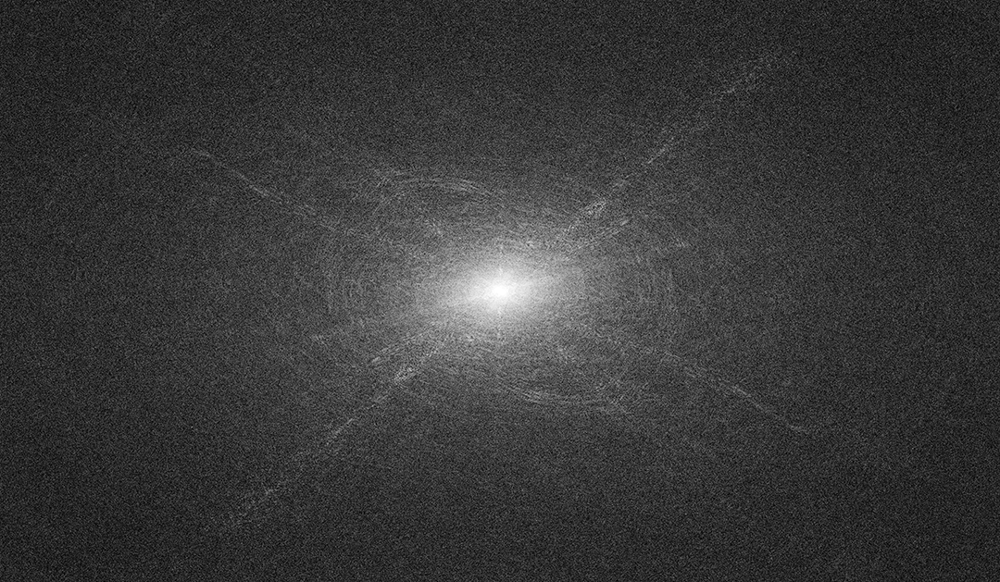
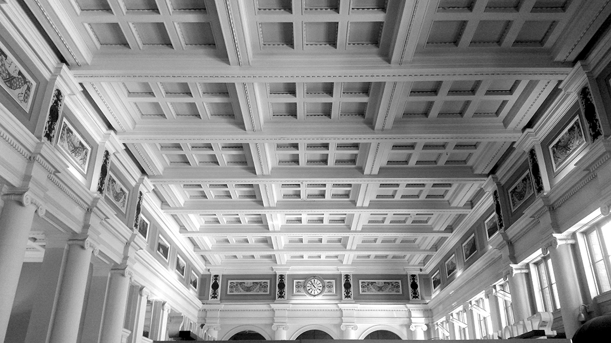
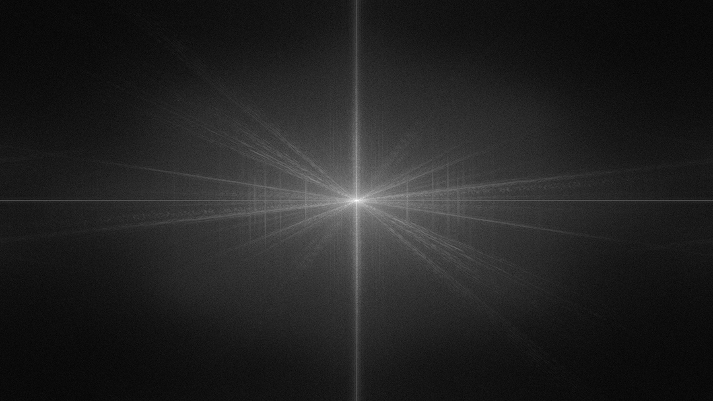
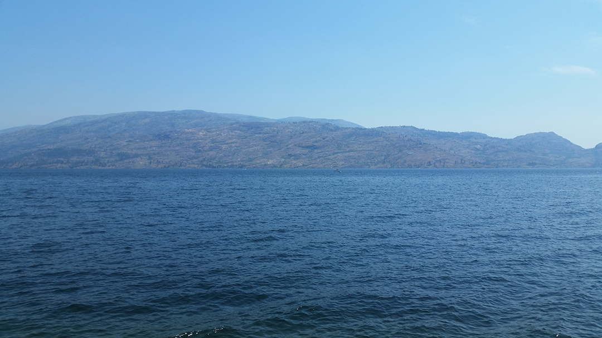
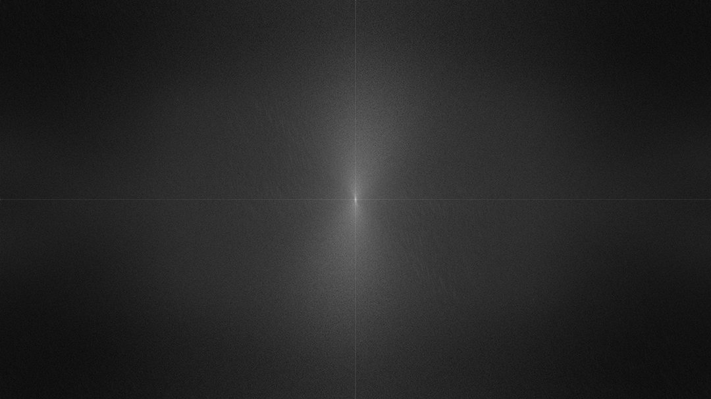
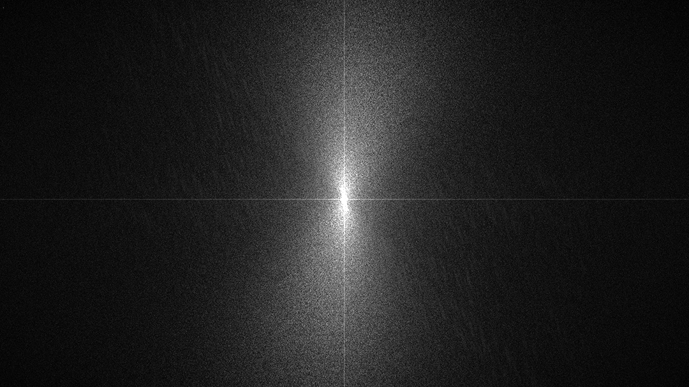

# Hidden Sector
## The World as Waveform

## The Group Conversation
#### How the conversation shaped the work
- Symmetry 
- Hidden sector
- Consciousness 

As a group we engaged with a variety of topics, including symmetry, consciousness, magic and the hidden sector. Early on, it became evident that we all had a different understanding of words and concepts and finding points of contact between art and physics was one of the more challenging and rewarding parts of the process. 
Early on we discussed ideas of symmetry (and symmetry-breaking) in physics - a concept that is both interesting and relatable to visual thinkers. These conversations had a great impact on my work and the choices I made while producing it. 
    
From a personal standpoint I am creating this work at a time where my environment is changing quite considerably as I depart to Iceland after spending 8 years in Vancouver. 
When I moved to Vancouver in 2011 I was overwhelmed by how the environment was different than anything I had experienced before. One of the major differences I noticed was that the ocean seemed to have a different 'personality' than I was used to. The Pacific Ocean seemed much calmer (and perhaps, more mystical) than the untame and unpredictable Atlantic Ocean. Staring at the ocean waves in English Bay I felt like I was speaking with a consciousness I hadn't met before - and I was fascinated. While in Iceland, I didn't give the ocean much thought - I didn't feel like it had a particular personality. It was just the ocean, and the ocean is always near. It wasn't until I experienced the Pacific Ocean that I realized that nature can take on a personality. Now that I am back in Iceland I am looking at the ocean from a different perspective. Now I see a lot of different types of waves, that all have their own characteristic. There are delicate ripples of interfering waves, creating intricate patterns - and in other parts (or on different days) there are violent and chaotic waves clashing against the coastline. The ocean no longer seems like *just* the ocean. Now I see that it is full of different feelings, emotions and unique compositions. 

At one point, while meditating by the Pacific Ocean, I had the feeling that the ocean itself was really standing still - it's surface was merely shifting due to waves passing through it. This is a feeling I wanted to capture in my work. Seeing ocean waves not as a chaotic shifting surface but as a separate set of waves of different frequencies and amplitudes modulating a field of stillness. For instance, a wave with a low frequency creates larger waves and higher frequencies create smaller waves. Blending these together creates a large wave with smaller ripples. In a way, I am trying to separate the wave itself from the medium it passes through. The medium of water simultaneously fascilitates the motion of the wave and reveals it's shape. The water does not move itself - the water is moved by the wave. 

#### Consciousness and Magical Thinking
Art and physics may seem like entirely different fields with their own ways of thinking, but on a human level I think the practicioners in both fields are seeking knowledge about how the world works and how we fit into that picture. 

## What I have generated for the project (how many pieces)
I have produced a computer program that converts videos to animated 2D Fourier Tranform plots. I am using this program to convert videos of ocean waves to animated plots that show how the frequency and amplitude of the waves change over time. 2D Fourier transform plots are traditionally set up so that the lowest frequencies appear at the center of the graph and the highest frequencies at the edges. Vertical edges in the image will appear as a horizontal line in the transformed image while horizontal edges appear vertical. Diagonal edges will appear as diagonal lines on the plot, and their tilt is determined by the angle. 
The first step in creating an animated Fourier transform plot was to process a single still image and convert it to a 2D Fourier transform. I was experimenting with this around the same time as scientists involved with the Event Horizon Telescope network produced the first image of a black hole - so I thought it would be an excellent subject matter for an initial test. I wanted to see if the aesthetics - and the *feeling* - of the image was preserved in the process.

*M87**, *Messier 87*. Credit:
EHT Collaboration
   

2D Fourier Transform of the M87*, Messier 87 image.

I was very excited to see the first image of a black hole. It's a massive stellar entity with a gravitational field that light cannot escape, and yet - somehow a group of scientists was able to connect a network of radio telescopes to capture and composit this extraordinary image. As to the image composition, there is something intruiging about the assymetry of the glowing halo around the object. It feels both unexpected and familiar at the same time. 

Looking at both images, I was happy to discover that the *feeling* I get from looking at both images is the same. This supports my belief that there might be something about the specific composition of frequencies in our visual field that creates an impression in our vision (and ultimately our consciousness) and can make us feel a certain way. The emotional effects of relative compositions of frequencies (and amplitude) are well known in music. We know that certain frequencies, relative to certain other ones, can create a specific emotional response. Composers and musicians take advantage of this when writing music. A simple example of this is chord composition. A major chord feels happy and uplifting and a minor chord can make you sad. As we generally accept this quality of sound, it makes sense to me that the same principles would apply to light (or any other medium for that matter).

Before starting to convert images of ocean waves, I wanted to gain an intuition of how simple geometry is transformed into the frequency domain. What kind of images could I expect to generate with this process? For this puspose I used an image of the ceiling at the Waterfront station, downtown Vancouver. As the image is composed mostly of straight lines running at different angles I expected to see several diagonal lines appear in the Fourier transform. Furthermore, because the image has several straight horizontal lines I expected a strong line to appear at the center on the vertical axis. 

Waterfront station ceiling.
   

Fourier transform of the Waterfront station ceiling. 
   

Comparing this set of images reveals that the structural components of the photograph are carried through the Fourier transform and the results are in line with what I expected to see. If we were to only look at the Fourier transform we could infer that the source image had a number of straight lines running through the image at different angles.

Now, as a final step before starting to process entire videos (i.e. sequences of still images), I wanted to transform images of ocean waves to see what the end result might look like. As ocean waves are mostly composed of horizontal edges I expected to see patterns emerge around the vertical axis,  

The Pacific Ocean, somehhere in BC, coordinates unknown.
   

The Pacific Ocean, Fourier transform.
   

In this set of images we see a much more gradual and even distribution of edge-angles, but if we look closely we can see several small streaks with a steep angle. These streaks are likely a result of the horizontal edges in the ocean waves. As I saw these patterns emerge I was hopeful that the end-result would animate these subtle patterns, perhaps conveying the feeling of these waves to the viewer through the transformed image. 

If we zoom in and adjust the levels in the image we can see the patterns a little better.

At this point, I was confident that the technique would work well with videos. As the waves moved in the video, the patterns would change in the animation. This would reveal the change in the frequency domain over time.

As you can see, the result shows patterns around the vertical axis (representing horizontal edge transitions). The pattern itself is mostly static but flows toward the center of the plot. To me, this captures the feeling I got when I meditated by the Pacific Ocean. The ocean is simultaneously sitting still *and* in motion.

As the end product of this process I will process a series of ocean-videos I've been filming during the summer and edit them into a 10-15 minute long video. 

